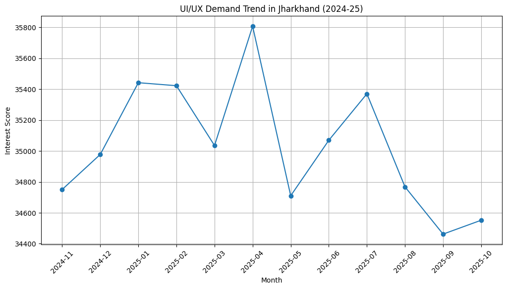
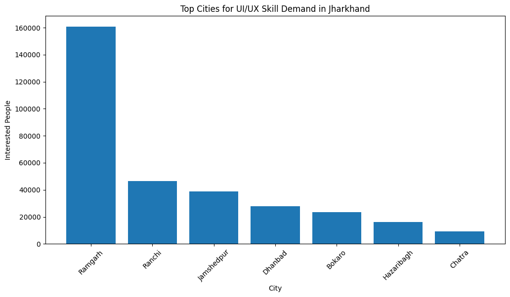
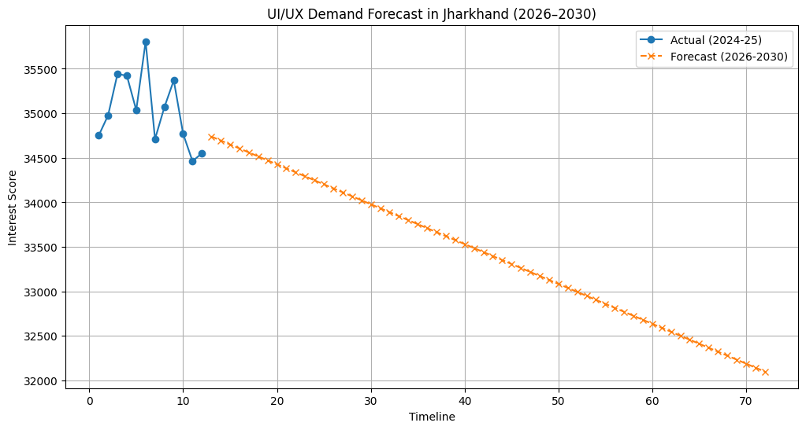
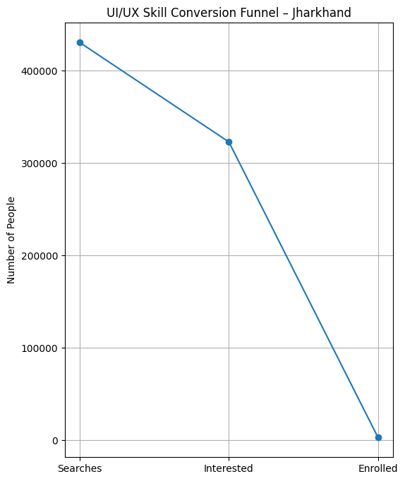

# UIUX-CAREER-TREND-JHARKHAND  
  UI/UX Skill Demand Analysis & Forecasting for Jharkhand (2024–2030)

---

## Objective  
This project analyzes UI/UX career demand in Jharkhand using real search interest trends, city-wise interest distribution, demand vs supply analysis, and future forecasting.

We answer:

- Which Jharkhand cities show the highest UI/UX interest?
- How is the demand trending month-to-month?
- Is there a supply-demand gap in institutes vs learners?
- What will the UI/UX market look like by 2030?

---

## Project Structure  


UIUX-CAREER-TREND-JHARKHAND/
│
├─ data/
│ └─ UI_UX jharkhand data - NOV 2024 - 25.csv
│
├─ notebooks/
│ └─ uiux_career_trend_jharkhand.ipynb
│
├─ images/
│ ├─ trend.png
│ ├─ top_cities.png
│ ├─ forecast.png
│ ├─ market_gap.png
│ └─ funnel.png
│
└─ README.md


---

## Key Visual Insights  

### 1️ Demand Trend – Jharkhand (2024–25)


 Monthly UI/UX interest score remains steady with small fluctuations.

---

### 2️ Top Cities by UI/UX Demand  


 Ramgarh, Ranchi, and Jamshedpur show strongest active interest signals.

---

### 3️ UI/UX Demand Forecast (2026–2030)


 Expected gradual rise as tech adoption improves in Tier-2 & Tier-3 cities.

---

### 4️ Market Gap – Demand vs Offline Institutes  


 Student demand is much higher vs institute availability → **huge growth opportunity**.

---

### 5️ Skill Funnel – Search → Interest → Students  


 There is **high search activity**, but very low actual enrollment → gap in awareness & accessibility.

---

##  Insights & Business Interpretation  

| Insight | Meaning |
|--------|---------|
| CAGR ~ **–0.57%** (flat trend) | Early adoption phase, not saturation |
| Ramgarh demand highest | Emerging design hub despite Tier-3 status |
| Offline institute count low | Clear **market-entry opportunity** |
| Forecast growth post-2026 | Skill maturity + EdTech expansion |

1. UI/UX learning is underserved compared to interest  
2. High upside for training companies in Jharkhand  
3. Right time to enter market before competition grows

---

## Tech Stack  

| Technology | Role |
|-----------|------|
| Python | Analysis & Forecast |
| Pandas | Data wrangling |
| Matplotlib | Visualizations |
| Scikit-learn (Linear Regression) | Forecasting |
| CAGR | Growth measurement |

---

## Dataset  

 Data based on search volume, city-wise share, and estimated conversion  
 Collected & structured for analysis purpose (2024 Nov – 2025 Oct data)

 data/UI_UX jharkhand data - NOV 2024 - 25.csv

 
---

##  How to Run  

1️. Clone repository  
```bash
git clone https://github.com/atlassandx90/UIUX-CAREER-TREND-JHARKHAND.git
cd UIUX-CAREER-TREND-JHARKHAND

2. Install required libraries
pip install pandas matplotlib scikit-learn

3️. Open Jupyter Notebook
notebooks/uiux_career_trend_jharkhand.ipynb
Run all cells → graphs recreate themselves.


---


👤 Author

Abhijeet Roy
Data Analyst — Forecasting & Insights
Linkedin - https://www.linkedin.com/in/abhijeetroy9

